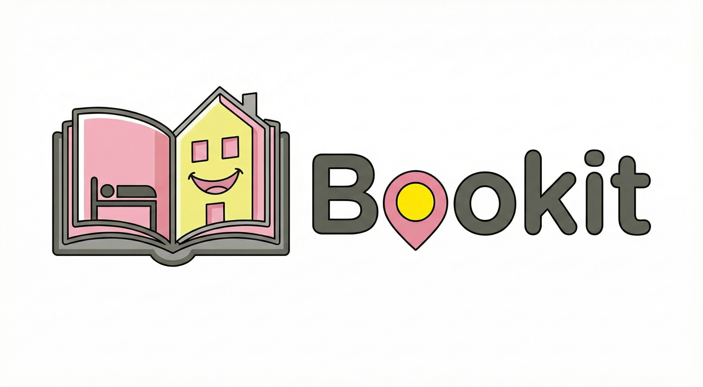

# BookIt ! Hotel Booking Website

## 1. Introduction

**BookIt!** is a web application designed to enable travelers to securely search for hotels and book rooms online.

The platform has two primary user roles : **Guest** (the client who makes reservations) and **Hotel Manager** (the service provider who lists and oversees hotels). 

## 2. Key User Roles
### The platform supports two main user roles:
1. **Guest (Traveler):** Guest Home, Search hotels, My Bookings, and My Profile.
2. **Hotel Manager (Service Provider):** Manager Home, Hotels, Booking approval, My profile

## 3. Access to the project / webapp
### Steps : 
1.  **Clone:** Copy URL from GitHub, Open IntelliJ, select Clone Repository, paste the URL and then Copy the project
2.  **Maven:** Run the Maven : select clean + compile + package + install, right click : Run Maven Build
3.  **Terminal:** Check the path of your project. If it's ok : Write "docker compose down", then write "compose up --build". It will deploy the generated `bookit-webapp-1.0-SNAPSHOT.war` file to your Application Server.
4.  **Access:** Open your browser to the application's context root (e.g., `http://localhost:8080/bookit-webapp-1.0-SNAPSHOT/Login.xhtml`).

## 4. Technology
* Java Development Kit (JDK) 17+
* Maven
* Postman
* A Jakarta EE Application Server (e.g., Payara)

## 5. Project Structure

### The application is structured into three distinct modules, corresponding to the layers of the architecture:

### bookit-domain :  (Domain Layer - Persistence)
* **Purpose:** Contains the core business logic and persistence definitions.
* **Key Contents:**
    * **Entities:** `Booking`, `Guest`, `Hotel`, `HotelManager`, `Payment`, `Room`, and `User`.
    * **Tests:** Dedicated unit tests for entities (`GuestTest`, `HotelTest`, `UserTest`, etc.).
### bookit-webservice :  (Service Layer - REST API)
* **Purpose:** Contains API resources.
    * **Packages:** `ch.unil.bookit.bookitwebservice`.
    * **Resources:** `AdminResource`, `ApplicationResource`, `BookingResource`, `GuestResource`, `ManagerResource`, `UserResource`.
    * **Focus:** API endpoints (Phase I).
### bookit-webapp :  (Presentation Layer - Web UI)
* **Purpose:** Contains all **JSF XHTML pages** and supporting managed beans.
  * **Packages:** `ch.unil.bookit.bookitwebapp`
      * **Beans:** `AuthenticationFilter.java`, `GuestBean.java`, `HotelBean.java`, `LoginBean.java`, `ManagerBean.java`, `RegisterBean.java`, `UserDada.java`
      * **Templates:** `CommonTemplate.xhtml`, `GuestTemplate.xhtml`, `ManagerTemplate.xhtml`. (The user interface uses Facelets Templates for consistency)
      * **Authentication:** `Login.xhtml` and `Register.xhtml` handle user access.
      * **Guest Flow:** `SearchHotels.xhtml`, `CreateBooking.xhtml`, `GuestBookings.xhtml`.
      * **Manager Flow:** `ManagerHome.xhtml`, `BookingApproval.xhtml`, `HotelManagement.xhtml`

## 6. UI Flow (Phase II Highlight)

The user interface is built on **JSF/PrimeFaces** and manages two distinct user journeys, utilizing Facelets templates (`GuestTemplate`/`ManagerTemplate`) for navigation and layout.

| Page                                          | Template                           | Functionality                                                                                        | Key UI Components (Extra Credit) |
|:----------------------------------------------|:-----------------------------------|:-----------------------------------------------------------------------------------------------------| :--- |
| **Login.xhtml** / **Register.xhtml**          | Standalone                         | Authentication and New User Sign-up.                                                                 | **`p:selectOneRadio`** for Role Selection. |
| **GuestHome.xhtml / ManagerHome.xhtml**       | GuestTemplate / ManagerTemplate    | **Guest/Manager Dashboard:** Welcome page, personalized greeting, and starting point for navigation. | *Special feature: Animated suitcase (Quality Bonus)*. |
| **SearchHotels.xhtml**                        | GuestTemplate                      | Main interface for searching hotels and viewing results.                                             | **`p:dataTable`** (for listing hotels). |
| **CreateBooking.xhtml**                       | GuestTemplate                      | Final confirmation and checkout page.                                                                | **`p:selectOneMenu`** (Dropdown for selection). |
| **GuestBookings.xhtml**                       | GuestTemplate                      | Lists all current, past, and pending reservations.                                                   | **`p:dataTable`** (for history). |
| **HotelManagement.xhtml**                     | ManagerTemplate                    | Manager interface to **create, edit, or delete** hotel listings (Hotel CRUD).                        | (Implements full Hotel/Room management). |
| **BookingApproval.xhtml**                     | ManagerTemplate                    | Lists incoming reservations for the manager to Approve or Reject.                                    | (Core Manager business action). |
| **GuestProfile.xhtml / ManagerProfile.xhtml** | Guest/ManagerTemplate              | View and update personal details and password.                                                       | `p:password` with `toggleMask`. |

## 7. Requirements Summary

This table outlines the compliance with the course's grading requirements:

| Phase | Core Requirement                                         | Compliant Component Examples |
| :--- |:---------------------------------------------------------| :--- |
| **Phase I (API)** | CRUD for +2 Domain Classes                               | `UserResource`, `HotelResource` (Implied by UI/Domain structure). |
| **Phase II (UI)** | 3+ UI Components  (output label, input text, and button) | **`p:inputText`**, **`p:outputLabel`**, **`p:commandButton`** (Basic) and **`p:dataTable`**, **`p:selectOneRadio`**, **`p:selectOneMenu`** (Extras). |
| **Phase III (Persistence)**| Persistence for ALL Domain Objects.                      | Defined in `bookit-domain` and `persistence.xml`  |

## 8. Member of the group BookIt

This project was developed by the following team members for the SOAR 2025 course:
* Duska Bogdanic
* Ana Paola Montero Cassab
* Olivia Kusch
* Malak Mohsen
* Marion Zimmerlin

---